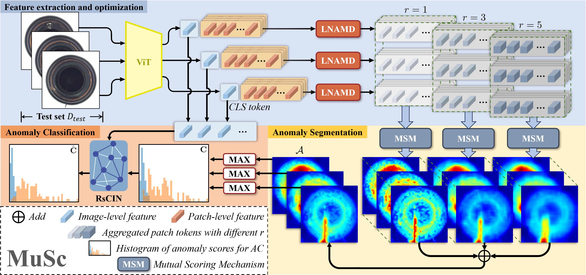

# ✨MuSc (ICLR 2024)✨

**This is an official PyTorch implementation for "MuSc : Zero-Shot Industrial Anomaly Classification and Segmentation with Mutual Scoring of the Unlabeled Images" (MuSc)**

Authors:  [Xurui Li](https://github.com/xrli-U)<sup>1*</sup> | [Ziming Huang](https://github.com/ZimingHuang1)<sup>1*</sup> | [Feng Xue](https://xuefeng-cvr.github.io/)<sup>3</sup> | [Yu Zhou](https://github.com/zhouyu-hust)<sup>1,2</sup>

Institutions: <sup>1</sup>Huazhong University of Science and Technology | <sup>2</sup>Wuhan JingCe Electronic Group Co.,LTD | <sup>3</sup>University of Trento

### 🧐  [Arxiv]()

## 👇Abstract

This paper studies zero-shot anomaly classification (AC) and segmentation (AS) in industrial vision. We reveal that the abundant normal and abnormal cues implicit in unlabeled test images can be exploited for anomaly determination, which is ignored by prior methods. Our key observation is that for the industrial product images, the normal image patches could find a relatively large number of similar patches in other unlabeled images, while the abnormal ones only have a few similar patches. 

We leverage such a discriminative characteristic to design a novel zero-shot AC/AS method by Mutual Scoring (MuSc) of the unlabeled images, which does not need any training or prompts. Specifically, we perform Local Neighborhood Aggregation with Multiple Degrees (**LNAMD**) to obtain the patch features that are capable of representing anomalies in varying sizes. Then we propose the Mutual Scoring Mechanism (**MSM**) to leverage the unlabeled test images to assign the anomaly score to each other. Furthermore, we present an optimization approach named Re-scoring with Constrained Image-level Neighborhood (**RsCIN**) for image-level anomaly classification to suppress the false positives caused by noises in normal images.

The superior performance on the challenging MVTec AD and VisA datasets demonstrates the effectiveness of our approach. Compared with the state-of-the-art zero-shot approaches, MuSc achieves a $\textbf{21.1}$\% PRO absolute gain (from 72.7\% to 93.8\%) on MVTec AD, a $\textbf{19.4}$\% pixel-AP gain and a $\textbf{14.7}$\% pixel-AUROC gain on VisA. In addition, our zero-shot approach outperforms most of the few-shot approaches and is comparable to some one-class methods.

 

## 😊Compare with other 0-shot methods

 

## 😊Compare with other 4-shot methods

 

## Setup

### Environment:

- Python 3.8
- CUDA 11.7
- PyTorch 2.0.1

Clone the repository locally:

```
git clone https://github.com/xrli-U/MuSc.git
```

Create virtual environment:

```
conda create --name musc python=3.8
conda activate musc
```

Install the required packages:

```
pip install torch==2.0.1 torchvision==0.15.2 torchaudio==2.0.2
pip install -r requirements.txt
```

## Datasets Download

- [MVTec AD](https://www.mvtec.com/company/research/datasets/mvtec-ad/)
- [VisA](https://amazon-visual-anomaly.s3.us-west-2.amazonaws.com/VisA_20220922.tar)

Put the datasets in `./data` folder.

```
data
|---mvtec_anomaly_detection
|-----|-- bottle
|-----|-----|----- ground_truth
|-----|-----|----- test
|-----|-----|----- train
|-----|-- cable
|-----|--- ...
|----visa
|-----|-- split_csv
|-----|-----|--- 1cls.csv
|-----|-----|--- ...
|-----|-- candle
|-----|-----|--- Data
|-----|-----|-----|----- Images
|-----|-----|-----|--------|------ Anomaly 
|-----|-----|-----|--------|------ Normal 
|-----|-----|-----|----- Masks
|-----|-----|-----|--------|------ Anomaly 
|-----|-----|--- image_anno.csv
|-----|-- capsules
|-----|--- ...
```

VisA dataset need to be preprocessed to separate the train set from the test set.

```
python ./datasets/visa_preprocess.py
```

## Run MuSc

We provide two ways to run our code.

### python

```
python examples/musc_main.py
```
Follow the configuration in `./configs/musc.yaml`.

### script

```
sh scripts/musc.sh
```
The configuration in the script `musc.sh` takes precedence.

The key arguments of the script are as follows:

- `--device`: GPU_id.
- `--data_path`: The directory of datasets.
- `--dataset_name`: Dataset name.
- `--class_name`: Category to be tested. If the parameter is set to `ALL`, all the categories are tested.
- `--backbone_name`: Feature exractor name. Our code is compatible with CLIP, DINO and DINO_v2. For more details, see `configs/musc.yaml`.
- `--pretrained`: Pretrained CLIP model. `openai`, `laion400m_e31`, and `laion400m_e32` are optional.
- `--feature_layers`: The layers for extracting features in backbone(ViT).
- `--img_resize`: The size of the image inputted into the model.
- `--divide_num`: The number of subsets the whole test set is divided into.
- `--r_list`: The aggregation degrees of our LNAMD module.
- `--output_dir`: The directory that saves the anomaly prediction maps and metrics. This directory will be automatically created.
- `--vis`: Whether to save the anomaly prediction maps.
- `--save_excel`: Whether to save anomaly classification and segmentation results (metrics).

## Classification optimization (RsCIN)

We provide additional code in `./models/RsCIN_features` folder to optimize the classification results of other methods using our RsCIN module. We use **ViT-large-14-336 of CLIP** to extract the image features of the MVTec AD and VisA datasets and store them in `mvtec_ad_cls.dat` and `visa_cls.dat` respectively. We show how to use them in `./models/RsCIN_features/RsCIN.py`.

### Example

Before using our RsCIN module, move `RsCIN.py`, `mvtec_ad_cls.dat` and `visa_cls.dat` to your project directory.

```
import numpy as np
from RsCIN import Mobile_RsCIN

classification_results = np.random.rand(83) # the classification results of your method.
dataset_name = 'mvtec_ad' # dataset name
class_name = 'bottle' # category name in the above dataset
optimized_classification_results = Mobile_RsCIN(classification_results, dataset_name=dataset_name, class_name=class_name)
```

The `optimized_classification_results` are the anomaly classification scores optimized by our RsCIN module.

### Apply to the custom dataset

You can extract the image features of each image in the custom dataset, and store them in the variable `cls_tokens`.
The multiple window sizes in the Multi-window Mask Operation can be adjusted by the value of `k_list`.

```
import numpy as np
from RsCIN import Mobile_RsCIN

classification_results = np.random.rand(83) # the classification results of your method.
cls_tokens = np.random.rand(83, 768)  # shape[N, C] the image features, N is the number of images
k_list = [2, 3] # the multiple window sizes in the Multi-window Mask Operation
optimized_classification_results = Mobile_RsCIN(classification_results, k_list=k_list, cls_tokens=cls_tokens)
```

## Citation
```
@inproceedings{Li2024MuSc,
  title={MuSc: Zero-Shot Industrial Anomaly Classification and Segmentation with Mutual Scoring of the Unlabeled Images},
  author={Li, Xurui and Huang, Ziming and Xue, Feng and Zhou, Yu},
  booktitle={International Conference on Learning Representations},
  year={2024}
}
```

## Thanks

Our repo is built on [PatchCore](https://github.com/amazon-science/patchcore-inspection) and [APRIL-GAN](https://github.com/ByChelsea/VAND-APRIL-GAN), thanks their clear and elegant code !


